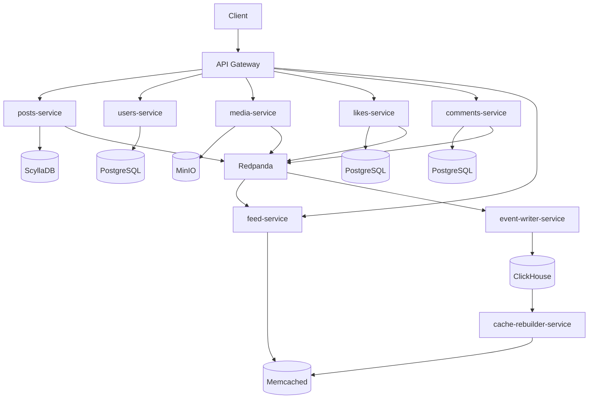
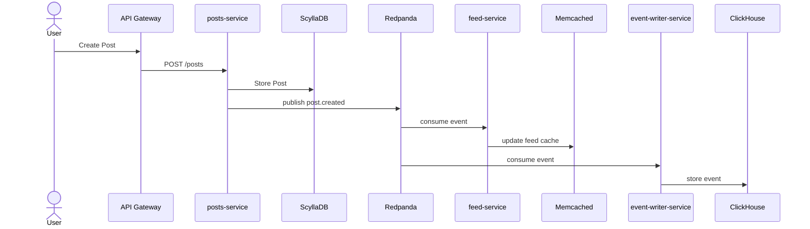
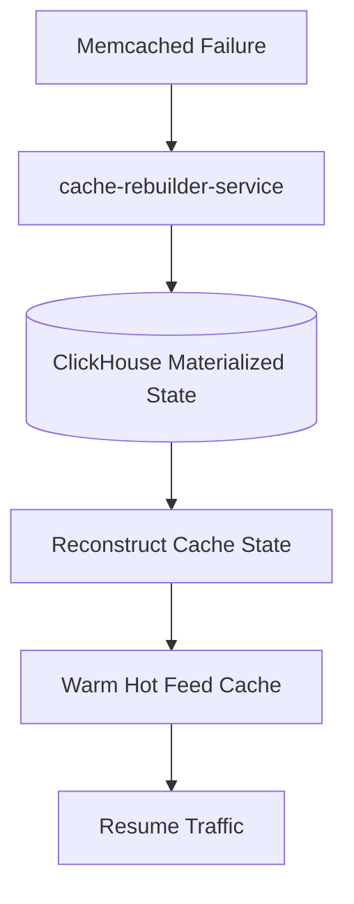

# Distributed Social Network — Local System Design POC

## Project Goal
Build a fully local, production-style distributed social network backend demonstrating advanced distributed systems architecture.

Core principles:
- Microservices
- CQRS
- Event Driven Architecture
- Eventual Consistency
- Self-Healing Cache Layer
- Horizontal Scalability

Deployment:
- Docker Compose
- Kubernetes (k3d / Minikube)

---

## Infrastructure Stack

- API Gateway: Traefik / Nginx
- Messaging: Redpanda
- Posts DB: ScyllaDB
- Comments DB: PostgreSQL
- Likes DB: PostgreSQL
- Users DB: PostgreSQL
- Object Storage: MinIO
- Feed Cache: Memcached
- Event Store + Recovery: ClickHouse
- Monitoring: Prometheus + Grafana + Loki + Jaeger

---

## High Level Architecture



---

## Event Flow



---

## Cache Recovery

ClickHouse acts as both:
- Analytics store
- Event sourcing backbone for cache reconstruction



---

## ClickHouse Schema

```sql
CREATE TABLE feed_events
(
    event_id UUID,
    event_type String,
    post_id String,
    user_id String,
    likes_delta Int32,
    comments_delta Int32,
    created_at DateTime
)
ENGINE = MergeTree()
ORDER BY (post_id, created_at);
```

Materialized view:

```sql
CREATE MATERIALIZED VIEW current_post_state
ENGINE = AggregatingMergeTree()
ORDER BY post_id
AS
SELECT
    post_id,
    countIf(event_type='like.created') as likes,
    countIf(event_type='comment.created') as comments,
    max(created_at) as last_update
FROM feed_events
GROUP BY post_id;
```

---

## Service List

- gateway-service
- posts-service
- comments-service
- likes-service
- feed-service
- users-service
- media-service
- notification-service
- event-writer-service
- cache-rebuilder-service

---

## Future Improvements

- Multi-node Scylla cluster
- ClickHouse replication
- Multi-node Memcached
- Recommendation engine
- Search service
- WebSocket notifications
- Chaos testing
