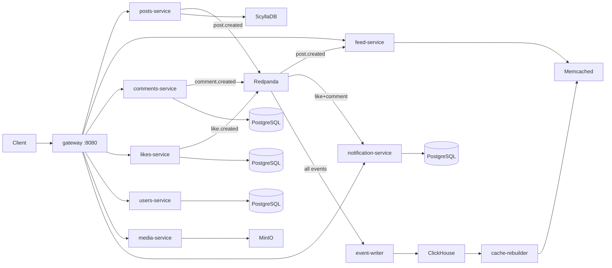

# Distributed Social Network

A microservices-based social network built with Go, demonstrating event-driven architecture, CQRS patterns, and full observability.

## Architecture



**10 Go microservices** communicating via REST + async events, backed by **14 infrastructure containers**:

| Layer | Technologies |
|-------|-------------|
| API Gateway | Go Fiber reverse proxy |
| Databases | ScyllaDB, PostgreSQL ×4 |
| Event Streaming | Redpanda (Kafka-compatible) |
| Event Store | ClickHouse |
| Caching | Memcached |
| Object Storage | MinIO |
| Observability | Prometheus, Grafana, Loki, Jaeger |

## Quick Start

```bash
# Prerequisites: Docker, Docker Compose, Go 1.24+

# Start everything (builds + runs 24 containers + applies migrations)
make fresh

# Run the end-to-end demo (creates users, posts, likes, comments, etc.)
make demo
```

After startup, these dashboards are available:

| Service | URL | Credentials |
|---------|-----|-------------|
| Gateway API | http://localhost:8080 | — |
| Prometheus | http://localhost:9090 | — |
| Grafana | http://localhost:3000 | admin / admin |
| Jaeger | http://localhost:16686 | — |
| Redpanda Console | http://localhost:8888 | — |
| MinIO Console | http://localhost:9001 | minioadmin / minioadmin |

## Make Commands

| Command | Description |
|---------|-------------|
| `make up` | Build and start all containers |
| `make down` | Stop all containers |
| `make fresh` | Clean slate: wipe volumes → rebuild → migrate |
| `make migrate` | Apply database schemas (idempotent) |
| `make demo` | Run end-to-end demo script |
| `make build` | Compile all service binaries locally |
| `make test` | Run tests across all services |
| `make lint` | Lint all services with golangci-lint |
| `make tidy` | Run `go mod tidy` in all modules |
| `make down-clean` | Stop containers and **delete all data volumes** |

## Project Structure

```
├── infrastructure/          Docker Compose files
│   ├── docker-compose.yml           Infrastructure (DBs, broker, monitoring)
│   └── docker-compose.services.yml  Application services
├── monitoring/
│   └── prometheus/prometheus.yml    Scrape config for all services
├── pkg/                     Shared library (database, cache, broker, ID generation)
├── scripts/
│   ├── migrate.sh           Database migration script
│   └── demo.sh              End-to-end demo script
├── services/
│   ├── gateway-service/     API gateway (reverse proxy)
│   ├── posts-service/       Posts CRUD (ScyllaDB)
│   ├── feed-service/        Feed aggregation (Memcached)
│   ├── comments-service/    Comments CRUD (PostgreSQL)
│   ├── likes-service/       Likes CRUD (PostgreSQL)
│   ├── users-service/       Users + follows (PostgreSQL)
│   ├── media-service/       File uploads (MinIO)
│   ├── notification-service/ Notifications (PostgreSQL + Kafka consumer)
│   ├── event-writer-service/ Event sourcing (ClickHouse)
│   └── cache-rebuilder-service/ Cache rebuild from event store
├── deploy/kubernetes/       Helm chart for K8s deployment
├── Makefile
└── go.work                  Go workspace file
```

## Documentation

| Document | Description |
|----------|-------------|
| [Architecture](docs/architecture.md) | System design, data flow, and patterns |
| [Services](docs/services.md) | Individual service details and responsibilities |
| [API Reference](docs/api.md) | Complete REST API documentation |
| [Infrastructure](docs/infrastructure.md) | Docker, databases, and monitoring setup |
| [Development](docs/development.md) | Local dev workflow, adding services, debugging |

## Tech Stack

- **Language:** Go 1.24
- **HTTP Framework:** Fiber v2
- **Databases:** ScyllaDB (posts), PostgreSQL 16 (users, comments, likes, notifications)
- **Message Broker:** Redpanda (Kafka API compatible)
- **Event Store:** ClickHouse
- **Cache:** Memcached
- **Object Storage:** MinIO (S3 compatible)
- **Observability:** Prometheus + Grafana, Loki (logs), Jaeger (traces)
- **Containerization:** Docker Compose (dev), Helm/Kubernetes (production)
