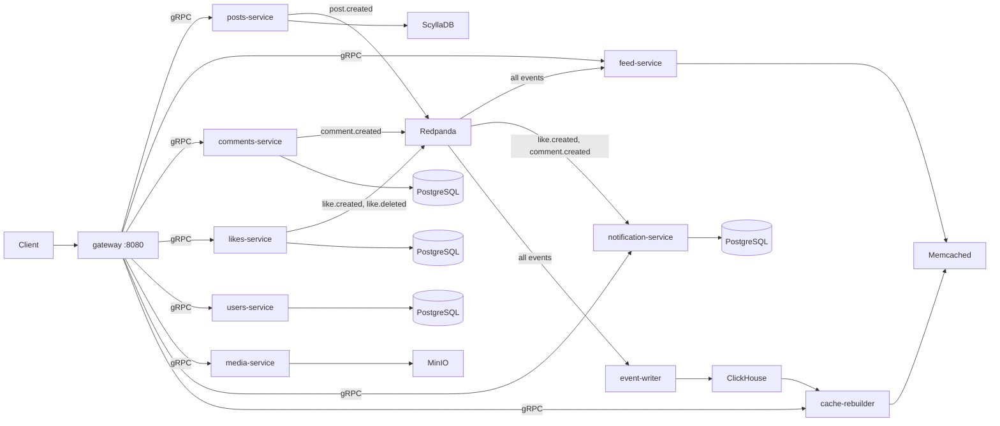

# Distributed Social Network

A microservices-based social network built with Go, demonstrating gRPC service-to-service calls, event-driven architecture, CQRS for the feed, and an event store for cache rebuilds.

## Architecture


```mermaid
graph LR
    Client --> Gateway[gateway :8080]
    Gateway -->|gRPC| Posts[posts-service]
    Gateway -->|gRPC| Feed[feed-service]
    Gateway -->|gRPC| Comments[comments-service]
    Gateway -->|gRPC| Likes[likes-service]
    Gateway -->|gRPC| Users[users-service]
    Gateway -->|gRPC| Media[media-service]
    Gateway -->|gRPC| Notif[notification-service]
    Gateway -->|gRPC| CacheRebuilder[cache-rebuilder]

    Posts -->|post.created| Redpanda
    Comments -->|comment.created| Redpanda
    Likes -->|like.created, like.deleted| Redpanda

    Redpanda -->|all events| Feed
    Redpanda -->|like.created, comment.created| Notif
    Redpanda -->|all events| EventWriter[event-writer]

    EventWriter --> ClickHouse
    ClickHouse --> CacheRebuilder
    CacheRebuilder --> Memcached
    Feed --> Memcached

    Posts --> ScyllaDB
    Comments --> PG1[(PostgreSQL)]
    Likes --> PG2[(PostgreSQL)]
    Users --> PG3[(PostgreSQL)]
    Notif --> PG4[(PostgreSQL)]
    Media --> MinIO
```

**10 Go microservices** communicating via gRPC + async events, plus a React UI, backed by **14 infrastructure containers**:

| Layer | Technologies |
|-------|-------------|
| API Gateway | Go Fiber, HTTP/JSON -> gRPC |
| Databases | ScyllaDB, PostgreSQL x4 |
| Event Streaming | Redpanda (Kafka-compatible) |
| Event Store | ClickHouse |
| Caching | Memcached |
| Object Storage | MinIO |
| Observability | Prometheus metrics; Grafana, Loki and Jaeger run in compose but are not wired up yet |

## Quick Start

```bash
# Prerequisites: Docker, Docker Compose, Go 1.24+, Node 22 (UI)

# Build and start all 24 containers (services apply their own migrations on startup)
make up

# Run the end-to-end demo (creates users, posts, likes, comments, etc.)
make demo

# UI dev server, proxies /api and /images to the gateway on :8080
cd ui && npm install && npm run dev
```

After startup, these are available:

| Service | URL | Credentials |
|---------|-----|-------------|
| Gateway API | http://localhost:8080 | - |
| Prometheus | http://localhost:9090 | - |
| Grafana | http://localhost:3000 | admin / admin |
| Redpanda Console | http://localhost:8888 | - |
| MinIO Console | http://localhost:9001 | minioadmin / minioadmin |

## Make Commands

| Command | Description |
|---------|-------------|
| `make up` | Build and start all containers |
| `make stop` / `make start` | Stop / start existing containers without removing or rebuilding them |
| `make down` | Stop and remove containers (keeps data volumes) |
| `make infra-up` / `make infra-down` | Infrastructure containers only |
| `make fresh` | Clean slate: wipe volumes -> rebuild (services migrate on startup) |
| `make down-clean` | Stop containers and **delete all data volumes** |
| `make demo` | Run end-to-end demo script |
| `make proto` | Regenerate gRPC stubs under `pkg/grpc/`, then `make dockerfiles` |
| `make dockerfiles` | Regenerate the `pkg/` COPY lines in every service Dockerfile |
| `make build` | Compile all service binaries into `bin/` |
| `make test` | Run tests in `pkg` and all services |
| `make lint` | Lint all services with golangci-lint |
| `make tidy` | Run `go mod tidy` in all modules |
| `make k8s-up` / `make k8s-down` | Install / uninstall both Helm charts in the current kube context (images from GHCR, tag `main`) |

## Project Structure

```
├── .github/workflows/       CI (vet, test, gofmt, UI lint/build) and image publish + deploy
├── deploy/
│   ├── images/minio/        MinIO built from source (upstream images discontinued)
│   └── kubernetes/          Helm charts (infra, services), deployed via GitOps
├── docs/                    Architecture, services, API, infrastructure, development
├── infrastructure/          Docker Compose files
│   ├── docker-compose.yml           Infrastructure (DBs, broker, monitoring)
│   └── docker-compose.services.yml  Application services
├── monitoring/
│   └── prometheus/prometheus.yml    Scrape config for all services
├── pkg/                     Shared library (broker, cache keys, database, events, generated gRPC, IDs)
├── proto/                   gRPC service definitions
├── scripts/
│   ├── gen-dockerfiles.sh   Regenerates Dockerfile pkg/ COPY lines
│   └── demo.sh              End-to-end demo script
├── services/
│   ├── gateway-service/     HTTP API, translates requests to gRPC
│   ├── posts-service/       Posts (ScyllaDB)
│   ├── feed-service/        Home and user feeds (Memcached)
│   ├── comments-service/    Comments (PostgreSQL)
│   ├── likes-service/       Likes (PostgreSQL)
│   ├── users-service/       Users + follows (PostgreSQL)
│   ├── media-service/       File uploads (MinIO)
│   ├── notification-service/ Notifications (PostgreSQL + event consumer)
│   ├── event-writer-service/ Event store writer (ClickHouse)
│   └── cache-rebuilder-service/ Cache rebuild from event store
├── ui/                      React + Vite frontend
├── Makefile
└── go.work                  Go workspace file
```

## Documentation

| Document | Description |
|----------|-------------|
| [Architecture](docs/architecture.md) | System design, data flow, and patterns |
| [Services](docs/services.md) | Individual service details and responsibilities |
| [API Reference](docs/api.md) | Gateway REST API |
| [Infrastructure](docs/infrastructure.md) | Docker, databases, and monitoring setup |
| [Development](docs/development.md) | Local dev workflow, adding services, debugging |
| [DataGrip](docs/datagrip.md) | Connecting a DB client to the local databases |

## Tech Stack

- **Language:** Go 1.24
- **RPC:** gRPC + Protocol Buffers between services; Fiber v2 for the gateway's HTTP API and each service's health/metrics port
- **Databases:** ScyllaDB (posts), PostgreSQL 16 (users, comments, likes, notifications)
- **Message Broker:** Redpanda (Kafka API compatible)
- **Event Store:** ClickHouse
- **Cache:** Memcached
- **Object Storage:** MinIO (S3 compatible)
- **UI:** React, Vite, Tailwind
- **Observability:** Prometheus (Grafana, Loki, Jaeger run in compose, not wired up yet)
- **Deployment:** Docker Compose (dev), Helm + Argo CD GitOps (production), arm64 images on GHCR
