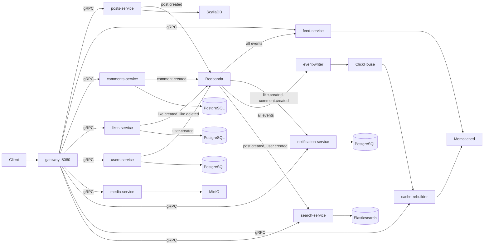

# Distributed Social Network

A microservices-based social network built with Go, demonstrating gRPC service-to-service calls, event-driven architecture, CQRS for the feed, and an event store for cache rebuilds.

## Architecture


```mermaid
graph LR
    Client --> Gateway[gateway :8080]
    Gateway -->|gRPC| Posts[posts-service]
    Gateway -->|gRPC| Feed[feed-service]
    Gateway -->|gRPC| Comments[comments-service]
    Gateway -->|gRPC| Likes[likes-service]
    Gateway -->|gRPC| Users[users-service]
    Gateway -->|gRPC| Media[media-service]
    Gateway -->|gRPC| Notif[notification-service]
    Gateway -->|gRPC| CacheRebuilder[cache-rebuilder]
    Gateway -->|gRPC| Search[search-service]

    Posts -->|post.created| Redpanda
    Comments -->|comment.created| Redpanda
    Likes -->|like.created, like.deleted| Redpanda
    Users -->|user.created| Redpanda

    Redpanda -->|all events| Feed
    Redpanda -->|like.created, comment.created| Notif
    Redpanda -->|all events| EventWriter[event-writer]
    Redpanda -->|post.created, user.created| Search
    Search --> ES[(Elasticsearch)]

    EventWriter --> ClickHouse
    ClickHouse --> CacheRebuilder
    CacheRebuilder --> Memcached
    Feed --> Memcached

    Posts --> ScyllaDB
    Comments --> PG1[(PostgreSQL)]
    Likes --> PG2[(PostgreSQL)]
    Users --> PG3[(PostgreSQL)]
    Notif --> PG4[(PostgreSQL)]
    Media --> MinIO
```

**11 Go microservices** communicating via gRPC + async events, plus a React UI, backed by **19 infrastructure containers**:

| Layer | Technologies |
|-------|-------------|
| API Gateway | Go Fiber, HTTP/JSON -> gRPC |
| Identity | Keycloak (OIDC, PKCE), JWTs verified at the gateway |
| Databases | ScyllaDB, PostgreSQL x4 |
| Event Streaming | Redpanda (Kafka-compatible) |
| Event Store | ClickHouse |
| Search | Elasticsearch |
| Caching | Memcached |
| Object Storage | MinIO |
| Observability | OpenTelemetry -> Jaeger, JSON logs -> Alloy -> Loki, Prometheus, Grafana |

## Quick Start

```bash
# Prerequisites: Docker, Docker Compose, Go 1.27+, Node 22 (UI)

# Build and start the core: the app and its stores, ~1 GB (services apply their own migrations on startup).
# Optional groups opt in, see below: make up OBS=1 SEARCH=1, or make up ALL=1 for everything
make up

# Run the end-to-end demo (creates alice, bob, charlie - password "password" - posts, likes, comments)
make demo

# Generate traffic, then open Grafana's DSN Overview dashboard
make up OBS=1 && make load

# UI dev server, proxies /api and /images to the gateway on :8080
cd ui && npm install && npm run dev
```

After startup, these are available:

| Service | URL | Credentials |
|---------|-----|-------------|
| Gateway API | http://localhost:8080 | - |
| Keycloak | http://localhost:8180/auth | admin / admin (console); demo users: password |
| MinIO Console | http://localhost:9001 | minioadmin / minioadmin |
| Prometheus (`OBS=1`) | http://localhost:9090 | - |
| Grafana (`OBS=1`) | http://localhost:3000 | admin / admin |
| Jaeger (`OBS=1`) | http://localhost:16686 | - |
| Redpanda Console (`TOOLS=1`) | http://localhost:8888 | - |
| Elasticsearch (`SEARCH=1`) | http://localhost:9200 | - |
| Kibana (`TOOLS=1 SEARCH=1`) | http://localhost:5601 | - |

### Optional groups

The core runs by default; each group is opt-in with its flag, the same on compose (`make up`, `make start`) and the k3d cluster (`make cluster-up`, `make cluster-profile`). `ALL=1` switches on all four.

| Flag | Adds | RAM | When off |
|------|------|-----|----------|
| `OBS=1` | Prometheus, Grafana, Loki, Alloy, Jaeger; services export traces | ~0.55 GB | no metrics, logs or traces |
| `TOOLS=1` | Redpanda Console, Kibana (with `SEARCH=1`) | ~1.2 GB | - |
| `SEARCH=1` | Elasticsearch, search-service | ~1.2 GB | search answers 503 `search is disabled`, trending is hidden |
| `EVENTS=1` | ClickHouse, event-writer, cache-rebuilder | ~0.7 GB | no event store; `/api/v1/rebuild` answers 503 |

Core alone is ~1 GB on compose; with `ALL=1`, ~5.4 GB.

On the k3d cluster (`make cluster-up`) the app is on https://localhost:8443 (http://localhost:8081 redirects) and the tools on `https://<name>.localhost:8443`: minio, plus grafana, prometheus, jaeger, redpanda and kibana when their group is on. Certificates come from a CA generated once per machine in `~/.config/dsn/`; `make trust-ca` adds it to the macOS keychain. `make forward` also puts everything on the URLs above, Kafka's 19092 aside.

## Make Commands

| Command | Description |
|---------|-------------|
| `make up` | Build and start the core plus the groups passed (`OBS=1 TOOLS=1 SEARCH=1 EVENTS=1`, `ALL=1`); stops groups left out |
| `make start` | `make up` without building images |
| `make stop` | Stop every container, whatever groups ran |
| `make down` | Stop and remove containers (keeps data volumes) |
| `make infra-up` / `make infra-down` | Infrastructure containers only |
| `make fresh` | Clean slate: wipe volumes -> rebuild (services migrate on startup) |
| `make down-clean` | Stop containers and **delete all data volumes** |
| `make demo` | Run end-to-end demo script (`CLUSTER=1` for the k3d cluster, same for `make load`) |
| `make load` | Mixed traffic for the dashboards (`DURATION=120 WORKERS=4`) |
| `make dlq` | List parked (DLQ) messages; `CMD="replay --topic like.created"` replays, `CMD=skip` discards |
| `make proto` | Regenerate gRPC stubs under `pkg/grpc/`, then `make dockerfiles` |
| `make dockerfiles` | Regenerate every service Dockerfile from its `pkg/` imports |
| `make build` | Compile all service binaries into `bin/` |
| `make test` | Run tests in `pkg` and all services |
| `make lint` | Lint `pkg` and all services with golangci-lint (config: `.golangci.yml`) |
| `make tidy` | Run `go mod tidy` in all modules |
| `make cluster-up` / `make cluster-down` | Create / delete the local k3d cluster, synced by Argo CD from the gitops repo (app on https://localhost:8443); takes the group flags |
| `make cluster-profile` | Switch the cluster's optional groups, e.g. `make cluster-profile OBS=1`; unset flags turn groups off, volumes are kept |
| `make trust-ca` | Trust the local cluster's CA in the macOS keychain (once per machine) |
| `make forward` | Port-forward the cluster to the same localhost ports as compose (all URLs above work), plus Argo CD on https://localhost:9443; prints the admin password |

## Project Structure

```
├── .github/workflows/       CI (vet, lint, test, gofmt, UI lint/build) and image publish + deploy
├── deploy/
│   ├── images/minio/        MinIO built from source (upstream images discontinued)
│   └── kubernetes/          Helm charts (infra, services, observability), deployed via GitOps
├── docs/                    Architecture, services, API, infrastructure, development
├── infrastructure/          Docker Compose files
│   ├── docker-compose.yml           Infrastructure (DBs, broker, monitoring)
│   └── docker-compose.services.yml  Application services
├── monitoring/                Prometheus (scrape, alerts), Grafana provisioning + dashboard, Alloy
├── pkg/                     Shared library (broker, cache keys, database, events, generated gRPC, IDs)
├── proto/                   gRPC service definitions
├── scripts/
│   ├── gen-dockerfiles.sh   Regenerates service Dockerfiles
│   ├── demo.sh              End-to-end demo script
│   ├── lib/auth.sh          Keycloak users and tokens for the scripts
│   ├── lib/env.sh           Compose or cluster (CLUSTER=1) URLs for the scripts
│   └── load.sh              Traffic generator (make load)
├── services/
│   ├── gateway-service/     HTTP API, translates requests to gRPC
│   ├── posts-service/       Posts (ScyllaDB)
│   ├── feed-service/        Home and user feeds (Memcached)
│   ├── comments-service/    Comments (PostgreSQL)
│   ├── likes-service/       Likes (PostgreSQL)
│   ├── users-service/       Users + follows (PostgreSQL)
│   ├── media-service/       File uploads (MinIO)
│   ├── notification-service/ Notifications (PostgreSQL + event consumer)
│   ├── event-writer-service/ Event store writer (ClickHouse)
│   ├── cache-rebuilder-service/ Cache rebuild from event store
│   └── search-service/      Post/user search, trending hashtags (Elasticsearch)
├── tools/dlq/               CLI for parked messages (make dlq)
├── ui/                      React + Vite frontend
├── Makefile
└── go.work                  Go workspace file
```

## Documentation

| Document | Description |
|----------|-------------|
| [Architecture](docs/architecture.md) | System design, data flow, and patterns |
| [Services](docs/services.md) | Individual service details and responsibilities |
| [API Reference](docs/api.md) | Gateway REST API |
| [Infrastructure](docs/infrastructure.md) | Docker, databases, and monitoring setup |
| [Development](docs/development.md) | Local dev workflow, adding services, debugging |
| [Search](docs/search.md) | Elasticsearch read model, indices, queries, reindexing |
| [ADR 0001](docs/adr/0001-search-engine.md) | Why Elasticsearch for search |
| [ADR 0002](docs/adr/0002-transactional-outbox.md) | Why a transactional outbox for events |
| [ADR 0003](docs/adr/0003-authentication-oidc-keycloak.md) | Why OIDC with Keycloak for authentication |
| [ADR 0004](docs/adr/0004-post-existence-check.md) | Why likes and comments check the post synchronously |
| [ADR 0005](docs/adr/0005-gateway-api.md) | Why Gateway API on k3s's Traefik instead of Ingress |
| [Observability](docs/observability.md) | Metrics, logs, traces, dashboard, alerts, things to try |
| [DataGrip](docs/datagrip.md) | Connecting a DB client to the local databases |

## Tech Stack

- **Language:** Go 1.27
- **RPC:** gRPC + Protocol Buffers between services; Fiber v2 for the gateway's HTTP API and each service's health/metrics port
- **Databases:** ScyllaDB (posts), PostgreSQL 16 (users, comments, likes, notifications)
- **Message Broker:** Redpanda (Kafka API compatible)
- **Event Store:** ClickHouse
- **Search:** Elasticsearch
- **Cache:** Memcached
- **Object Storage:** MinIO (S3 compatible)
- **UI:** React, Vite, Tailwind
- **Observability:** OpenTelemetry, Jaeger, Prometheus, Loki + Alloy, Grafana
- **Deployment:** Docker Compose (dev), Helm + Argo CD GitOps (production), arm64 images on GHCR
