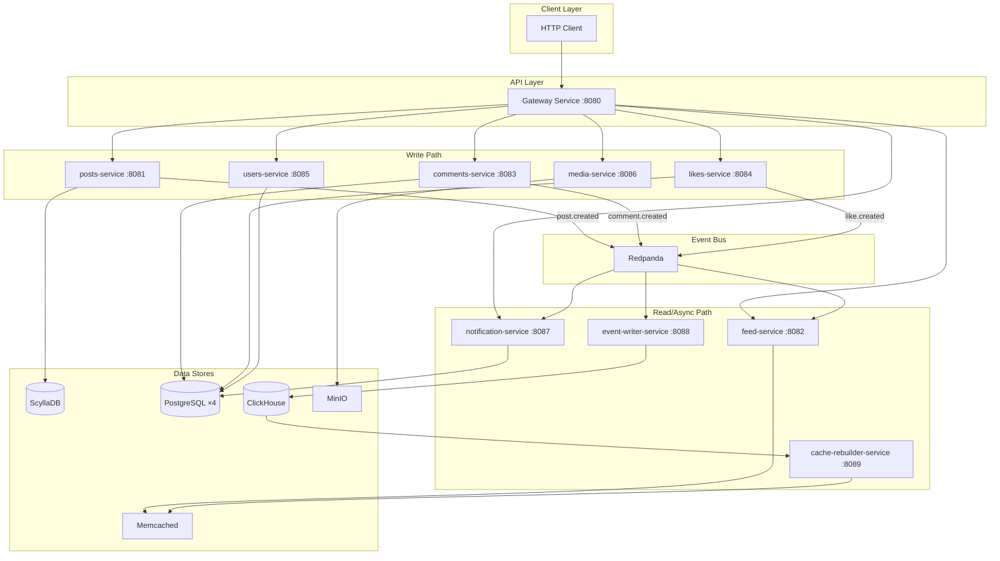
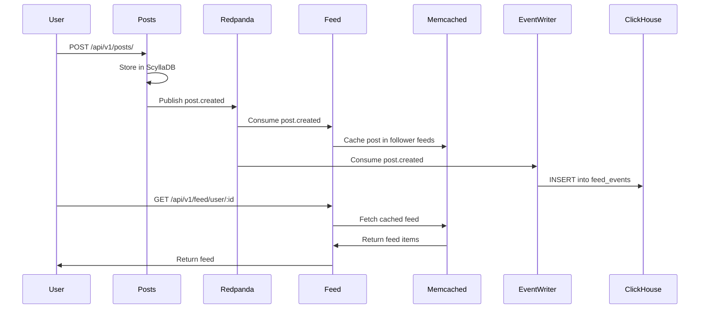

# Architecture

## Overview

The system follows an **event-driven microservices** architecture with CQRS (Command Query Responsibility Segregation) for the feed system.



## Design Patterns

### Event-Driven Communication

Services communicate asynchronously through Redpanda (Kafka-compatible) topics:

| Topic | Producer | Consumers |
|-------|----------|-----------|
| `post.created` | posts-service | feed-service, event-writer-service |
| `like.created` | likes-service | notification-service, event-writer-service |
| `comment.created` | comments-service | notification-service, event-writer-service |

Each consumer uses a dedicated **consumer group** ensuring exactly-once processing per group:
- `feed-service` — fans out posts to follower caches
- `notification-service` — generates notifications for content owners
- `event-writer-service` — persists all events to ClickHouse for analytics

### CQRS for Feed

The feed system separates writes from reads:

1. **Write side:** When a user creates a post, the event flows through Redpanda
2. **Fanout-on-write:** Feed-service consumes `post.created` and pushes to each follower's Memcached feed cache
3. **Read side:** Feed queries hit Memcached directly (fast, no DB joins)
4. **Rebuild:** If cache is cold, cache-rebuilder reconstructs feeds from ClickHouse event store



### Event Sourcing

All write events are persisted to ClickHouse as an append-only event store:

```sql
CREATE TABLE feed_events (
    event_id UUID,
    event_type String,     -- 'post.created', 'like.created', 'comment.created'
    post_id String,
    user_id String,
    likes_delta Int32,     -- +1 for like events
    comments_delta Int32,  -- +1 for comment events
    created_at DateTime
) ENGINE = MergeTree()
ORDER BY (post_id, created_at);
```

A materialized view aggregates current post state:

```sql
CREATE MATERIALIZED VIEW current_post_state
ENGINE = AggregatingMergeTree()
ORDER BY post_id
AS SELECT
    post_id,
    countIf(event_type='like.created') as likes,
    countIf(event_type='comment.created') as comments,
    max(created_at) as last_update
FROM feed_events
GROUP BY post_id;
```

### API Gateway Pattern

The gateway-service acts as a reverse proxy, providing:
- Single entry point for all clients (port 8080)
- Request routing based on URL prefix
- Centralized metrics collection
- Request/response logging

### Database-per-Service

Each service owns its data store, chosen for its workload:

| Service | Database | Rationale |
|---------|----------|-----------|
| posts | ScyllaDB | High write throughput, wide-column model for timeline data |
| users | PostgreSQL | Relational data with ACID guarantees (follows = join table) |
| comments | PostgreSQL | Structured text with indexes on entity_id |
| likes | PostgreSQL | Unique constraints (user+entity), simple key-value |
| notifications | PostgreSQL | Ordered reads by user, boolean flags |
| feed | Memcached | Pure cache, rebuilt from event store on miss |
| events | ClickHouse | Columnar analytics, fast aggregations |
| media | MinIO | S3-compatible object storage for binary files |

## Service Communication

```
┌─────────────────────────────────────────────────────────────┐
│                    Synchronous (HTTP)                         │
│                                                              │
│  Client → Gateway → Service → Database                       │
│                                                              │
└─────────────────────────────────────────────────────────────┘

┌─────────────────────────────────────────────────────────────┐
│                   Asynchronous (Events)                       │
│                                                              │
│  Service → Redpanda Topic → Consumer Service → Side Effect   │
│                                                              │
│  Examples:                                                    │
│    posts-service → post.created → feed-service (cache write) │
│    likes-service → like.created → notification-service (DB)  │
│    * → event-writer-service (ClickHouse append)              │
│                                                              │
└─────────────────────────────────────────────────────────────┘
```

## Observability

All services expose a `/metrics` endpoint via `fiberprometheus`:

- **Prometheus** scrapes all 10 services every 15s
- **Grafana** provides dashboards (connected to Prometheus data source)
- **Loki** aggregates container logs
- **Jaeger** captures distributed traces (via OpenTelemetry)

Standard metrics exposed per service:
- `http_requests_total` — counter by method, path, status
- `http_request_duration_seconds` — histogram of latencies
- `go_*` — Go runtime metrics (GC, goroutines, memory)
