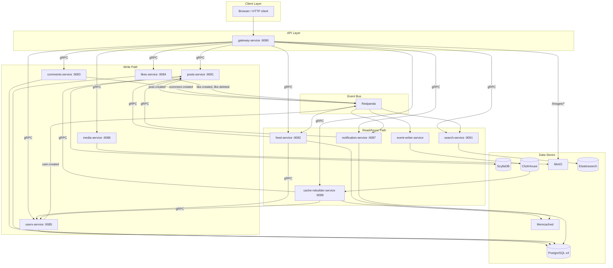
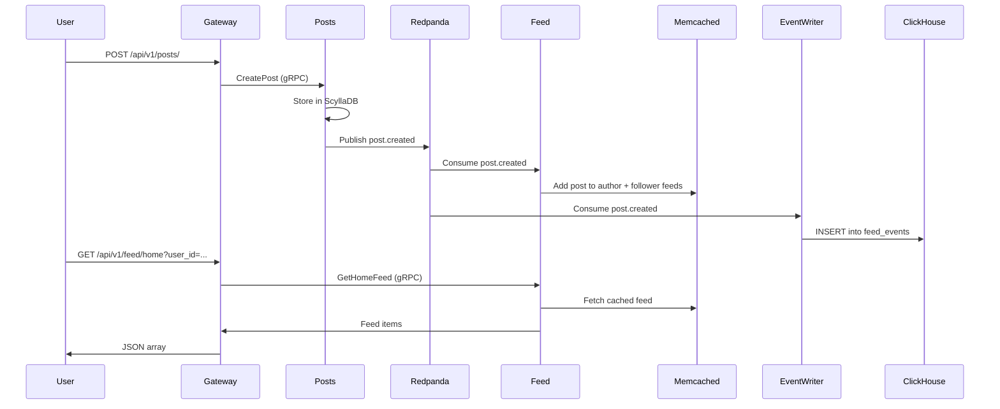

# Architecture

[<- README](../README.md) · **Architecture** · [Services](services.md) · [API](api.md) · [Infrastructure](infrastructure.md) · [Development](development.md) · [Observability](observability.md) · [Search](search.md)

---

## Overview

The system follows an **event-driven microservices** architecture. Clients talk HTTP/JSON to the gateway, the gateway and services talk gRPC, and state changes propagate as events on Redpanda. The feed uses CQRS: writes go through events, reads come from Memcached.


```mermaid
graph TB
    subgraph "Client Layer"
        Client[Browser / HTTP client]
    end

    subgraph "API Layer"
        GW[gateway-service :8080]
    end

    subgraph "Write Path"
        Posts[posts-service :9081]
        Comments[comments-service :9083]
        Likes[likes-service :9084]
        Users[users-service :9085]
        Media[media-service :9086]
    end

    subgraph "Event Bus"
        RP[Redpanda]
    end

    subgraph "Read/Async Path"
        Feed[feed-service :9082]
        Notif[notification-service :9087]
        EW[event-writer-service]
        CR[cache-rebuilder-service :9089]
        Search[search-service :9091]
    end

    subgraph "Data Stores"
        ScyllaDB[(ScyllaDB)]
        PG[(PostgreSQL x4)]
        CH[(ClickHouse)]
        MC[Memcached]
        MIO[MinIO]
        ES[(Elasticsearch)]
    end

    Client --> GW
    GW -->|gRPC| Posts & Comments & Likes & Users & Media & Feed & Notif & CR & Search
    GW -->|/images/*| MIO

    Posts --> ScyllaDB
    Posts -->|post.created| RP
    Comments --> PG
    Comments -->|comment.created| RP
    Likes --> PG
    Likes -->|like.created, like.deleted| RP
    Users --> PG
    Users -->|user.created| RP
    Media --> MIO

    RP --> Feed
    RP --> Notif
    RP --> EW
    RP --> Search

    Feed --> MC
    Feed -->|gRPC| Users & Posts
    Notif --> PG
    Notif -->|gRPC| Posts
    EW --> CH
    CH --> CR
    CR --> MC
    CR -->|gRPC| Users & Posts
    Search --> ES
```

Ports shown are gRPC ports. Every service also serves `/health` and `/metrics` over HTTP on its `PORT` (8081-8089, search 8091).

## Design Patterns

### Event-Driven Communication

Services communicate asynchronously through Redpanda (Kafka-compatible) topics. Topic names live in `pkg/events`:

| Topic | Producer | Consumers |
|-------|----------|-----------|
| `post.created` | posts-service | feed-service, event-writer-service, search-service |
| `like.created` | likes-service | feed-service, notification-service, event-writer-service |
| `like.deleted` | likes-service | feed-service, event-writer-service |
| `comment.created` | comments-service | feed-service, notification-service, event-writer-service |
| `user.created` | users-service | search-service |

Topics are created on startup by `pkg/broker.EnsureTopics` (3 partitions each). Each consumer uses its own **consumer group**, so every service receives every event:
- `feed-service` - fans out posts to follower feeds, updates like/comment counts
- `notification-service` - generates notifications for post authors
- `event-writer-service` - persists all post activity events to ClickHouse
- `search-service` - indexes posts and users into Elasticsearch

Delivery is **at-least-once** (`pkg/broker.Consume`): the offset is committed only after the handler succeeds. A failing message is retried 3 times with backoff, then published to `<topic>.dlq` and skipped. Nothing consumes the DLQ topics yet. `pkg/broker.ConsumeBatch` (event-writer, search-service) does the same per batch of up to 500 messages or 200ms, and retries a failing batch message by message so only the bad ones are parked. Handlers are written to tolerate redelivery:
- feed-service fanout is idempotent, and feed cache writes use memcache CAS to avoid lost updates between concurrent consumers
- event-writer derives `event_id` from topic/partition/offset, so a redelivered message writes a row with the same id and readers deduplicate by it
- likes-service emits `like.created` / `like.deleted` only when the row actually changed, so a repeated like or unlike emits nothing

### CQRS for Search

Search is a second read model on the same stream: search-service indexes `post.created` and `user.created` into Elasticsearch and answers queries from it. Details in [Search](search.md), the decision in [ADR 0001](adr/0001-search-engine.md).

### CQRS for Feed

The feed system separates writes from reads:

1. **Write side:** When a user creates a post, the event flows through Redpanda
2. **Fanout-on-write:** feed-service consumes `post.created` and pushes the post into each follower's home feed (`feed:<id>`) and the author's own feed (`userposts:<id>`) in Memcached
3. **Read side:** Feed queries hit Memcached directly (no DB joins)
4. **Rebuild:** cache-rebuilder reconstructs feeds from the ClickHouse event store on request (`POST /api/v1/rebuild`)


```mermaid
sequenceDiagram
    participant User
    participant Gateway
    participant Posts
    participant Redpanda
    participant Feed
    participant Memcached
    participant EventWriter
    participant ClickHouse

    User->>Gateway: POST /api/v1/posts/
    Gateway->>Posts: CreatePost (gRPC)
    Posts->>Posts: Store in ScyllaDB
    Posts->>Redpanda: Publish post.created
    Redpanda->>Feed: Consume post.created
    Feed->>Memcached: Add post to author + follower feeds
    Redpanda->>EventWriter: Consume post.created
    EventWriter->>ClickHouse: INSERT into feed_events
    User->>Gateway: GET /api/v1/feed/home?user_id=...
    Gateway->>Feed: GetHomeFeed (gRPC)
    Feed->>Memcached: Fetch cached feed
    Feed->>Gateway: Feed items
    Gateway->>User: JSON array
```

### Event Store

All domain events are appended to ClickHouse:

```sql
CREATE TABLE feed_events (
    event_id UUID,         -- derived from topic/partition/offset
    event_type String,     -- 'post.created', 'like.created', 'like.deleted', 'comment.created'
    post_id String,
    user_id String,
    likes_delta Int32,     -- +1 for like.created, -1 for like.deleted
    comments_delta Int32,  -- +1 for comment.created
    created_at DateTime
) ENGINE = MergeTree()
ORDER BY (post_id, created_at);
```

cache-rebuilder-service aggregates current post state at query time, collapsing duplicate `event_id` rows first so a redelivered event counts once:

```sql
SELECT pid AS post_id, sum(dlikes) AS likes, sum(dcomments) AS comments, max(first_seen) AS last_update
FROM (
    SELECT event_id, any(post_id) AS pid, any(likes_delta) AS dlikes,
           any(comments_delta) AS dcomments, min(created_at) AS first_seen
    FROM feed_events
    WHERE post_id != ''
    GROUP BY event_id
)
GROUP BY pid;
```

### API Gateway Pattern

gateway-service is the only public entry point (port 8080). It:
- Exposes a REST/JSON API under `/api/v1` and translates each request into a gRPC call
- Maps gRPC status codes to HTTP (`NotFound` -> 404, `InvalidArgument` -> 400, `AlreadyExists` -> 409, else 500)
- Proxies `/images/*` to the public-read MinIO bucket
- Adds CORS, request logging, and Prometheus metrics

There is no authentication: the acting user is passed in the request body or query (`user_id`, `follower_id`, `author_id`).

### Database-per-Service

Each service owns its data store, chosen for its workload:

| Service | Database | Rationale |
|---------|----------|-----------|
| posts | ScyllaDB | High write throughput, wide-column model for timeline data |
| users | PostgreSQL | Relational data with ACID guarantees (follows = join table) |
| comments | PostgreSQL | Structured text with indexes on entity_id |
| likes | PostgreSQL | Unique constraint on (user_id, entity_id) |
| notifications | PostgreSQL | Ordered reads by user, boolean flags |
| feed | Memcached | Pure cache, rebuilt from the event store |
| events | ClickHouse | Columnar store, fast aggregations |
| media | MinIO | S3-compatible object storage for binary files |

## Service Communication

```
Synchronous (gRPC)
  Client -HTTP-> Gateway -gRPC-> Service -> Database
  feed-service, cache-rebuilder -gRPC-> users-service (followers), posts-service (post details)
  notification-service -gRPC-> posts-service (post author)

Asynchronous (events)
  Service -> Redpanda topic -> consumer service -> side effect
    posts-service -> post.created -> feed-service (cache write)
    likes-service -> like.created -> notification-service (DB)
    * -> event-writer-service (ClickHouse append)
```

## Observability

Wired through `pkg/observability` and `pkg/broker`; details, dashboards and exercises in [Observability](observability.md).

- **Traces**: OpenTelemetry over HTTP -> gRPC -> Kafka headers -> consumers, so a request and the events it causes are one trace (Jaeger)
- **Logs**: JSON `slog` with `trace_id`, shipped by Alloy to Loki
- **Metrics**: gateway HTTP, gRPC server/client, and publish/consume/retry/DLQ metrics per service; consumer lag from Redpanda (Prometheus)
- Grafana has the three datasources linked and a provisioned **DSN Overview** dashboard
- The Helm charts do not include the observability stack; without `OTEL_EXPORTER_OTLP_ENDPOINT` services only log and expose `/metrics`
