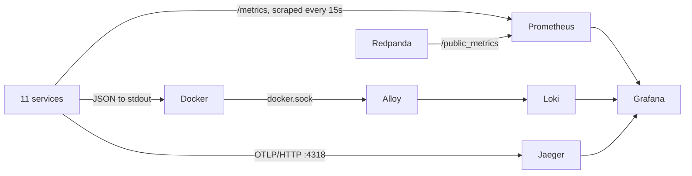

# Observability

[<- README](../README.md) · [Architecture](architecture.md) · [Services](services.md) · [API](api.md) · [Infrastructure](infrastructure.md) · [Development](development.md) · **Observability** · [Search](search.md)

---

Metrics, logs and traces for all 11 services, correlated by trace id. Compose runs the stack below; on the local k3d cluster the `observability` chart runs the same configs from `monitoring/` (see [Kubernetes](#kubernetes)).

## Quick start

```bash
make up OBS=1              # the stack is opt-in; on k3d: make cluster-profile OBS=1
make load                  # 120s of mixed traffic, 4 workers; or: make load DURATION=600 WORKERS=8
open http://localhost:3000 # admin / admin, lands on "DSN Overview"
```

| Tool | URL | Use it for |
|------|-----|------------|
| Grafana | http://localhost:3000 | Dashboard, Explore (PromQL / LogQL / traces), alert rules |
| Prometheus | http://localhost:9090 | Raw queries, `/targets`, `/alerts` |
| Jaeger | http://localhost:16686 | Trace search and waterfall |
| Loki | http://localhost:3100 | API only; query through Grafana |
| Alloy | http://localhost:12345 | Log pipeline debug UI |
| Redpanda Console | http://localhost:8888 | Topics, messages, `.dlq` topics, consumer groups |

### Kubernetes

`make cluster-up` deploys the `deploy/kubernetes/observability` chart through Argo CD. Its `files/` is a symlink to `monitoring/`, so the scrape config, alerts, datasources and dashboard are the ones compose uses; only log collection differs (`monitoring/alloy/kubernetes.alloy` reads pod logs through the API and labels them by the pod's `app` label, which matches the compose service names). Every UI gets an HTTPRoute on the `dsn` Gateway, on https://<name>.localhost:8443 and http://<name>.localhost:8081:

| Tool | URL |
|------|-----|
| Grafana | https://grafana.localhost:8443 (admin / admin) |
| Prometheus | https://prometheus.localhost:8443 |
| Jaeger | https://jaeger.localhost:8443 |
| Redpanda Console | https://redpanda.localhost:8443 |
| MinIO Console | https://minio.localhost:8443 |
| Kibana (`kibana.enabled`) | https://kibana.localhost:8443 |

The dashboard's links to Jaeger and Prometheus point at the compose ports.

## How it is wired



Shared code: `pkg/observability` (logger, tracer, gRPC options) and `pkg/broker` (Kafka trace propagation + metrics).

| Signal | Source | Notes |
|--------|--------|-------|
| Traces | `otelfiber` (gateway), `otelgrpc` (all gRPC servers and clients), `pkg/broker` (publish / process spans) | Trace context rides in Kafka headers, so a request and every consumer it triggers are **one trace**. Exported only when `OTEL_EXPORTER_OTLP_ENDPOINT` is set |
| Logs | `slog` JSON on stdout, std `log` routed through it | Every line has `service`; lines logged with a traced context add `trace_id`, `span_id`. `LOG_LEVEL=debug` for more |
| Metrics | see below | Go runtime and process metrics on every service too |

### Metrics

| Metric | Labels | From |
|--------|--------|------|
| `http_requests_total`, `http_request_duration_seconds` | `method`, `path` (route), `status_code` | gateway |
| `grpc_server_handled_total`, `grpc_server_handling_seconds` | `grpc_service`, `grpc_method`, `grpc_code` | every gRPC server |
| `grpc_client_handled_total`, `grpc_client_handling_seconds` | same | gateway, feed, notification, cache-rebuilder |
| `broker_messages_published_total` | `topic`, `result` (`ok`, `error`) | producers |
| `outbox_backlog`, `outbox_oldest_age_seconds` | `service` | comments, likes, users, posts |
| `broker_messages_consumed_total` | `topic`, `group`, `result` (`ok`, `dlq`, `dropped`, `error`) | consumers, final outcome per message |
| `broker_handler_failures_total` | `topic`, `group` | consumers, each failed attempt (3 before DLQ) |
| `broker_handler_duration_seconds` | `topic`, `group` | consumers, per attempt |
| `redpanda_kafka_consumer_group_lag_sum` / `_max` | `redpanda_group` | Redpanda; enabled by the `redpanda-init` one-shot container |

Lag comes from the broker rather than the consumer: a dead consumer can't report its own lag.

### Correlation

- **Log -> trace**: in Grafana Explore (Loki) or the dashboard's log panel, expand a line; the `TraceID` link opens the trace.
- **Trace -> logs**: in Grafana Explore (Jaeger), a span's "Logs for this span" runs `{service="<span service>"} |= "<trace id>"`.
- Jaeger UI search: service + operation, or tags such as `error=true`.

### Alerts

`monitoring/prometheus/alerts.yml`, visible at http://localhost:9090/alerts and in Grafana under Alerting -> Alert rules. No Alertmanager, so nothing is sent anywhere.

| Alert | Fires when |
|-------|-----------|
| `ServiceDown` | a scrape target is down for 1m |
| `GatewayHighErrorRate` | gateway 5xx > 5% for 2m |
| `GRPCServerErrors` | a method returns `Internal`, `Unavailable`, `Unknown`, `DeadlineExceeded` or `DataLoss` for 2m |
| `EventsDeadLettered` | a consumer gave up on a message (DLQ, dropped, or failed to park) in the last 10m |
| `ConsumerLagHigh` | a group is > 500 messages behind for 5m |
| `OutboxStuck` | a service's oldest unpublished event is > 60s old for 2m |

## Things to try

Run `make load DURATION=600` in one terminal and watch **DSN Overview** while doing these.

**1. Follow one request end to end.** Jaeger -> service `gateway-service`, operation `/api/v1/posts/` -> open a trace. Expected: gateway -> posts-service `CreatePost` -> `publish post.created` -> `process post.created` in feed-service and event-writer-service, plus feed's `GetFollowers` call to users-service. Under load event-writer processes batches: its span then starts its own trace and links to each producer span (`messaging.batch.message_count` tag).

**2. Kill a dependency.**
```bash
docker stop infrastructure-posts-service-1
# watch: Services down goes to 1, ServiceDown fires after 1m, gateway 5xx rises,
# "Failures, DLQ, drops" climbs as feed/notification retries fail on like/comment events
docker start infrastructure-posts-service-1
```
Then in the log panel pick a feed-service or notification-service ERROR line, jump to its trace, and see each retry as a failed `GetPost` span.

**3. Slow a consumer down.** Pause ClickHouse under load: `docker pause infrastructure-clickhouse-1`, wait a minute, `docker unpause infrastructure-clickhouse-1`. Inserts block rather than fail, so consumer lag for `event-writer-service` climbs by thousands, then drains within seconds of the unpause in batches of up to 500; nothing is parked.

**4. Stop a consumer.** `docker stop infrastructure-notification-service-1` for a minute: lag keeps rising (broker-side), events are not lost, and they drain on `docker start`.

**5. Trace an error to its cause.** Take a database away from one service:
```bash
docker stop infrastructure-comments-db-1
curl -s -XPOST localhost:8080/api/v1/comments/ -H 'Content-Type: application/json' \
  -d '{"entity_id":"<post id>","user_id":"<user id>","text":"hi"}'
docker start infrastructure-comments-db-1
```
The call is a 500, `GRPCServerErrors` fires for `comments-service CreateComment` under load, and the failed span's status carries the Postgres connection error.

**6. Take the broker away.** Writes keep succeeding and their events wait in the outbox:
```bash
docker stop infrastructure-redpanda-1
# like, comment and create users for a minute (UI or curl)
docker start infrastructure-redpanda-1
```
"Outbox backlog" climbs per service while Redpanda is down (`OutboxStuck` fires after ~3m) and drops to 0 within seconds of the restart. In Jaeger, a like made during the outage is still one trace: the request, then `publish like.created` attempts backing off 1s, 2s, 4s, 8s until one succeeds, then the consumers. Consumers resume up to 30s after the broker returns (their reconnect backoff).

**7. Replay what was parked.** Stop posts-service, like a post, start posts-service again:
```bash
docker stop infrastructure-posts-service-1
# like a post in the UI
docker start infrastructure-posts-service-1
make dlq                                   # two pending entries: feed-service-likes and notification-service
make dlq CMD="replay --topic like.created" # one event replayed for both
```
"DLQ awaiting replay" rises and returns to 0; the like then shows in the feed and as a notification.  A replay that still fails (the cause isn't fixed yet) is parked again; `make dlq` shows it. `CMD=skip` marks pending messages as handled without replaying.

### Query cheat sheet

```promql
# gateway p95 by route
histogram_quantile(0.95, sum by (le, path) (rate(http_request_duration_seconds_bucket{job="gateway-service"}[5m])))
# gRPC error ratio per service
sum by (job) (rate(grpc_server_handled_total{grpc_code!="OK"}[5m])) / sum by (job) (rate(grpc_server_handled_total[5m]))
# events processed per consumer group
sum by (group) (rate(broker_messages_consumed_total{result="ok"}[5m]))
```

```logql
{service="gateway-service"} | json | status >= 500
{service=~".+-service"} | json | level="ERROR"
{service="feed-service"} | json | msg="handler attempt failed" | line_format "{{.topic}} {{.error}}"
sum by (service) (count_over_time({service=~".+-service"} | json | level=~"WARN|ERROR" [5m]))
```

## Limits

- Jaeger is in-memory: traces are gone after a restart. Pinned to 2.20.0 because 2.21 removed the HTTP API Grafana's Jaeger datasource uses.
- 100% of traces are sampled; fine locally, not for production.
- No database, cache or object-storage spans: a DB call is inside its gRPC server span, not a span of its own.
- No infra exporters for PostgreSQL, ScyllaDB, ClickHouse, Memcached or MinIO; only Redpanda is scraped.
- Alloy reads the Docker socket, so it ships every compose container's logs, including the data stores' plain-text ones.
