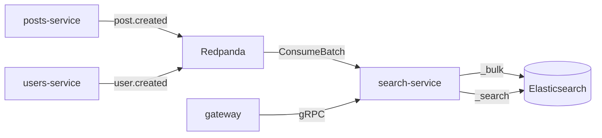

# Search

[<- README](../README.md) · [Architecture](architecture.md) · [Services](services.md) · [API](api.md) · [Infrastructure](infrastructure.md) · [Development](development.md) · [Observability](observability.md) · **Search**

---

Full-text search over posts and users, and trending hashtags, served by `search-service` from Elasticsearch. Why Elasticsearch and what it costs: [ADR 0001](adr/0001-search-engine.md).

## Quick start

```bash
make up SEARCH=1 && make demo   # search is opt-in; on k3d: make cluster-profile SEARCH=1
curl -s 'localhost:8080/api/v1/search/posts?q=deploying'          # stemming: matches "deployed"
curl -s 'localhost:8080/api/v1/search/posts?q=%23golang'          # hashtag (%23 is #)
curl -s 'localhost:8080/api/v1/search/users?q=ali'                # username prefix
curl -s 'localhost:8080/api/v1/search/hashtags/trending?hours=24'
make up SEARCH=1 TOOLS=1        # adds Kibana: Dev Tools at http://localhost:5601/app/dev_tools#/console
```

In the UI: **Search** in the sidebar (`/search?q=`, Posts and People tabs, matches highlighted), every `#hashtag` in a post links to its search, and the right column lists trending hashtags. Highlights come back from Elasticsearch with the post text unescaped, so the UI renders them as text with marked spans, never as HTML.

## How it works



- Indexing: consumer group `search-service`, one `_bulk` request per batch (up to 500 events or 200ms). `_id` is the post or user id, so redelivery rewrites the same document. Retries, DLQ and metrics are the shared `pkg/broker` ones
- Freshness: event consumed + 1s index refresh. Search is **eventually consistent** with the write path
- Startup: indices are created before any indexing starts; writing to a missing alias would auto-create an index with guessed mappings

## Indices

Defined in `services/search-service/internal/repository/indices/`, one file per versioned index, each carrying its alias. Code only uses the aliases.

| Alias | Index | Fields |
|-------|-------|--------|
| `posts` | `posts-v1` | `text` (english analyzer: stemming, stop words) + `text.exact` (standard), `hashtags` (keyword, lowercased at index time), `author_id`, `image_id`, `created_at` |
| `users` | `users-v1` | `username` (edge n-grams of the whole lowercased name, for prefixes) + `username.exact` (keyword), `bio` (english), `created_at` |

Mappings are `strict`: a document with an unknown field is rejected, retried, then parked on `<topic>.dlq`.

## Queries

In `internal/repository/queries.go`, as plain JSON, so they paste into Kibana Dev Tools.

| Endpoint | Query |
|----------|-------|
| `search/posts?q=words` | `multi_match` over `text` and `text.exact^2` with `fuzziness: AUTO`, times a recency decay (`gauss` on `created_at`, a week-old post scores half), `text` highlighted with `<em>` |
| `search/posts?q=%23tag` | `term` on `hashtags`, same recency decay |
| `search/users?q=...` | exact username (boost 10) or username prefix (boost 3) or bio words (fuzzy); a leading `@` is ignored |
| `search/hashtags/trending` | `terms` aggregation on `hashtags` over posts from the last `hours` (default 24) |

## Changing a mapping

1. Add `indices/posts-v2.json` with the new mapping and **no** alias
2. Reindex and swap atomically:
   ```http
   POST _reindex
   {"source": {"index": "posts-v1"}, "dest": {"index": "posts-v2"}}

   POST _aliases
   {"actions": [
     {"remove": {"index": "posts-v1", "alias": "posts"}},
     {"add": {"index": "posts-v2", "alias": "posts", "is_write_index": true}}
   ]}
   ```
3. Move the alias into `posts-v2.json`, delete `posts-v1.json` and the old index

## Things to try (Kibana Dev Tools)

```http
GET posts/_mapping
GET posts/_analyze
{"field": "text", "text": "Deploying microservices quickly"}

GET users/_analyze
{"field": "username", "text": "Alice_Dev"}

GET posts/_search
{"query": {"match": {"text": {"query": "architectur", "fuzziness": "AUTO"}}}, "explain": true}

GET posts/_search
{"size": 0, "aggs": {"per_day": {"date_histogram": {"field": "created_at", "calendar_interval": "day"}}}}
```

In Jaeger, a search request is one trace: gateway -> `search.SearchService/SearchPosts` -> the Elasticsearch `search` span with the index and status.

## Limits

- Users and posts created before search-service existed are only indexed if their events are still in Redpanda (7-day retention); there is no backfill from the owning services yet
- No updates or deletes: nothing emits them. Likes and comments don't affect ranking
- No auth or TLS on Elasticsearch, in compose or in the cluster (reachable only inside it). The Helm chart runs one node with a 512 MB heap and `node.store.allow_mmap: false`, so the host needs no `vm.max_map_count` change
